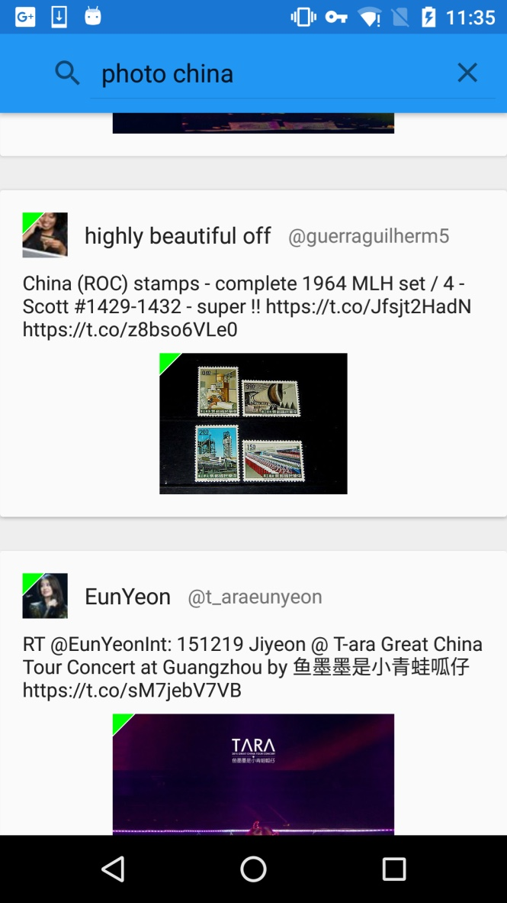
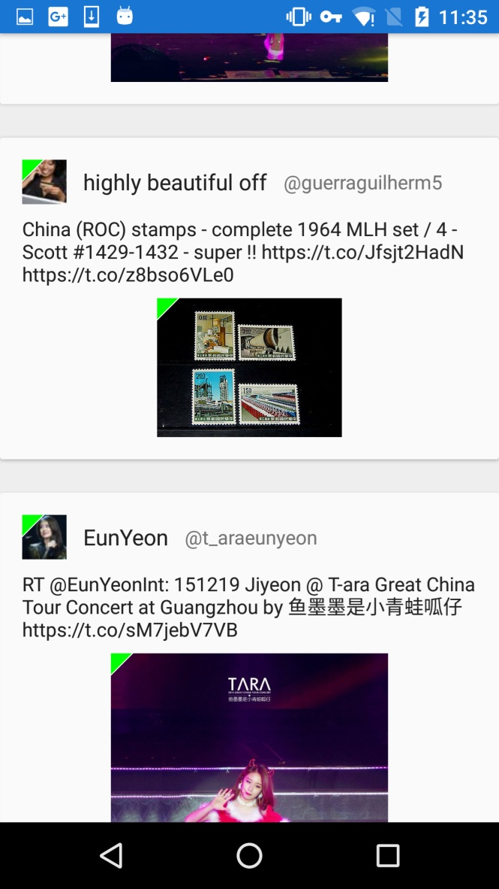
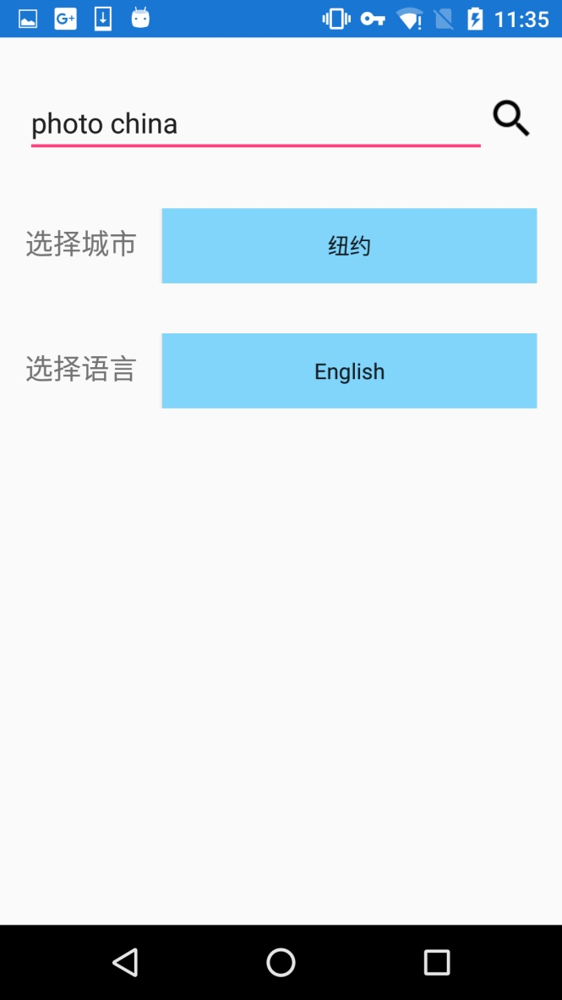

# TwitterSearcher

##一个符合Material Design规范的Twitter搜索App

整体结构受[Android-CleanArchitecture](https://github.com/android10/Android-CleanArchitecture)启发

##使用类库：

###Support lib, Material Design:
RecyclerView、
Design、
Support-Annotations、
CardView

###异步操作、观察者模式、模拟EventBus
RxJava、RxAndroid、

###网络请求、图片请求：
OkHttp、
Retrofit、
Picasso、
Gson

###依赖注入：
Dagger2、
Butterknife

###Debug:
Timber、
okhttp:logging-interceptor、
rxjava-debug

##界面展示

####Material Design风格的卡片式View：

####向下滚动搜索框消失，向上滚动搜索框出现：

####提供根据地点和语言过滤的选项：

